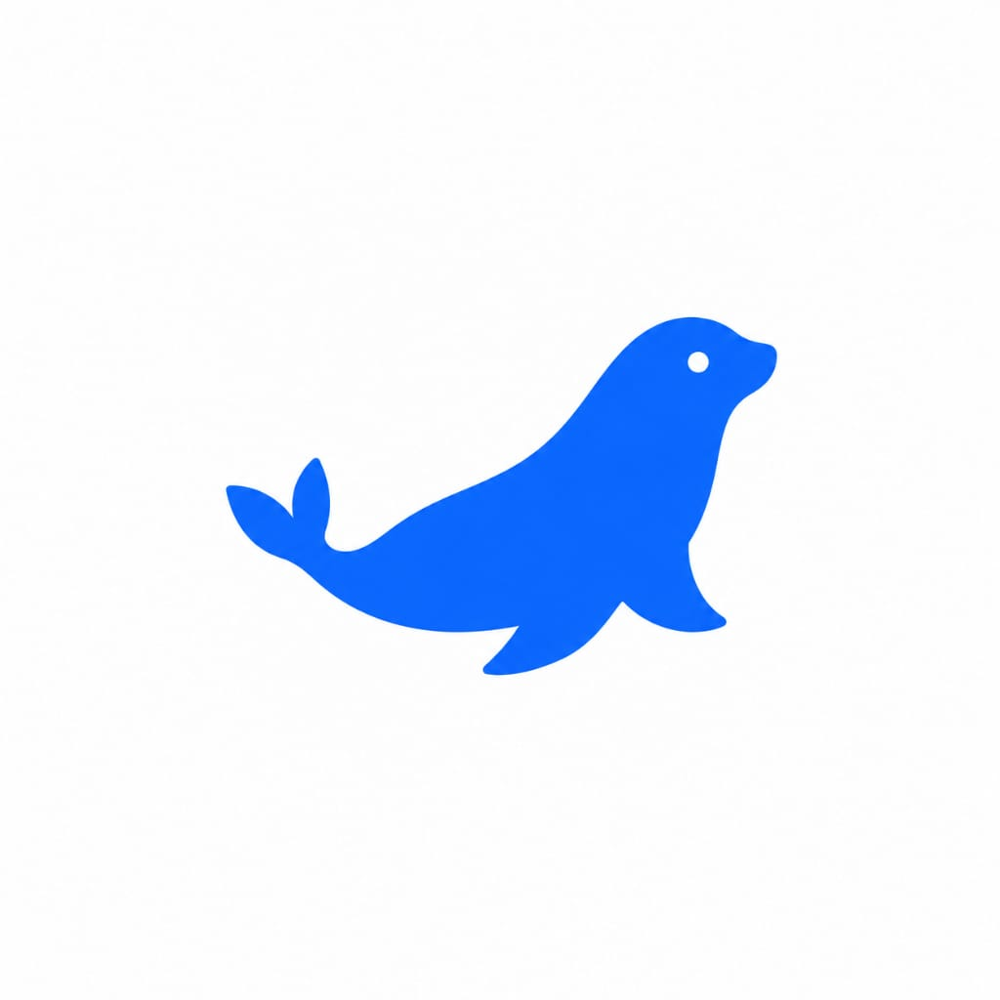
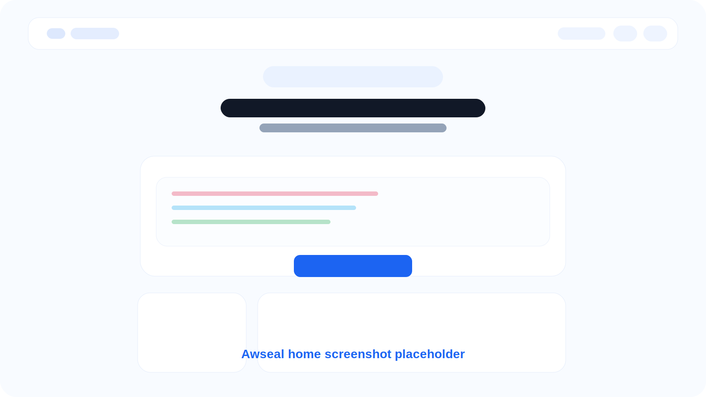
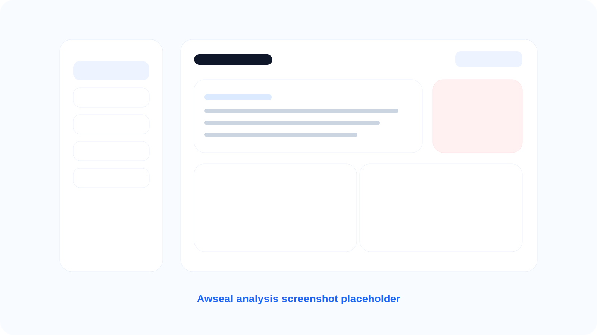

# Awseal

<p align="center">
  
</p>

<p align="center">
  Open Source Cloud Security Assistant para AWS, IAM, DevSecOps e Engenharia de Plataforma.
</p>

<p align="center">
  <a href="https://nextjs.org/">
    
  </a>
  <a href="https://www.typescriptlang.org/">
    
  </a>
  <a href="https://tailwindcss.com/">
    
  </a>
  <a href="https://ai.google.dev/">
    
  </a>
  <a href="./LICENSE">
    
  </a>
</p>

---

## ✨ Sobre o Projeto

Awseal é um assistente open source focado em segurança cloud, criado para ajudar profissionais de AWS, DevSecOps, Cloud Security e Platform Engineering a entender permissões IAM, erros AccessDenied, logs AWS, eventos CloudTrail e riscos de privilege escalation de forma rápida e humana.

A proposta do projeto é transformar análises complexas de segurança em explicações simples, práticas e úteis para engenheiros, estudantes e times de segurança.

---

## 🚀 Funcionalidades

- Análise de policies IAM
- Detecção de permissões perigosas
- Análise de logs AWS
- Explicação de erros `AccessDenied`
- Detectores locais de segurança
- Integração híbrida com Gemini
- Explicações humanizadas
- Dark Mode
- UI moderna e minimalista
- Deploy otimizado para Vercel

---

## 🧠 Como Funciona

1. O usuário cola uma policy IAM, log AWS, evento CloudTrail ou erro AccessDenied.
2. O Awseal sanitiza a entrada e aplica limite de caracteres.
3. Detectores locais identificam:
   - wildcards (`*`)
   - `iam:*`
   - `s3:*`
   - `AdministratorAccess`
   - `sts:AssumeRole`
   - privilege escalation
   - permission sprawl
4. A análise local se torna a fonte técnica principal.
5. Se existir uma `GEMINI_API_KEY`, a IA transforma o resultado em uma explicação humana.
6. Caso a IA falhe, o sistema retorna a análise local automaticamente.

---

## 📸 Screenshots

### Home



### Analysis



---

## 📂 Estrutura do Projeto

```text
app/
  api/analyze/route.ts
  layout.tsx
  page.tsx

components/
  awseal-app.tsx
  json-editor.tsx
  result-panel.tsx
  loading-analysis.tsx
  ui/*

lib/
  analysis/detectors.ts
  analysis/sanitize.ts
  llm/gemini.ts
  llm/index.ts
  llm/prompt.ts
  constants.ts
  types.ts
```

---

## ⚙️ Instalação Local

### 1. Clone o repositório

```bash
git clone https://github.com/seu-usuario/awseal.git
```

### 2. Entre na pasta

```bash
cd awseal
```

### 3. Instale as dependências

```bash
npm install
```

### 4. Configure as variáveis de ambiente

Crie um arquivo `.env.local`:

```env
GEMINI_API_KEY=sua-chave-aqui
```

### 5. Rode o projeto

```bash
npm run dev
```

### 6. Abra no navegador

```text
http://localhost:3000
```

---

## ☁️ Deploy

O Awseal está pronto para deploy na Vercel.

### Build de produção

```bash
npm run build
```

### Rodar produção

```bash
npm start
```

---

## 🔒 Segurança

- Sanitização de entrada
- Limite de caracteres
- Timeout inteligente da IA
- Fallback local automático
- Sem necessidade de credenciais AWS
- Detectores locais independentes da IA

---

## 🛣️ Roadmap

- [ ] Terraform Analysis
- [ ] Kubernetes Analysis
- [ ] CloudTrail Expansion
- [ ] VSCode Extension
- [ ] CLI
- [ ] Export Markdown
- [ ] Policy Diff
- [ ] Multi-cloud
- [ ] Risk Scoring
- [ ] Attack Path Detection

---

## 🤝 Contribuição

Contribuições são bem-vindas.

Especialmente em:

- IAM
- Cloud Security
- AWS
- UX/UI
- Detectores de segurança
- Performance
- Acessibilidade

### Fluxo sugerido

```bash
git checkout -b feat/minha-feature

npm install

npm run dev
```

Depois abra um Pull Request explicando:

- o problema resolvido
- screenshots das mudanças
- edge cases tratados

---

## 👨‍💻 Autor

Leonardo do Vale

Criado com foco em democratizar segurança cloud, IAM e DevSecOps para a comunidade brasileira.

---

## 📄 Licença

MIT License.

Veja o arquivo:

```text
LICENSE
```

---

## © Direitos Autorais

© 2026 Leonardo do Vale. Todos os direitos reservados.

Awseal é um projeto open source distribuído sob a licença MIT.

---

## 🌎 Visão

Awseal não é apenas um analisador de policies.

A proposta é construir uma plataforma open source moderna de segurança cloud capaz de ajudar estudantes, profissionais e empresas a entender riscos AWS de forma simples, rápida e acessível.
